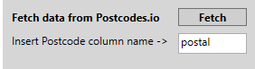

# SQlitePeopleDB

# Description
- Load database of people from .csv or .db files.
- Calculate most common email domains
- Calculate largest groups of people geographically close to each other using Postcode.io API

# Usage
#Import data
- Select which file to import (.csv or .sb), specifying new settings for database, table names and separators

- The data will be displayed as follows

#Execute most common email domain
- Insert name of the email column from main table
- Insert number of records to display
- Press Execute to display the most common email domains

#Execute largest groups of people geographically close to each other
- Insert name of the postcode column from main table
- Press Fetch to display to download the coordinates from database

- The data will be displayed as follows

- Insert number of records to display (groups of people)
- Insert range in km used to determine the clusters of people
- Insert minimum amount of people per cluster
- Press Execute to calculate

- The data will be displayed as follows

# Copyright
All licenses in this repository are copyrighted by their respective authors. See License.mb for details.
